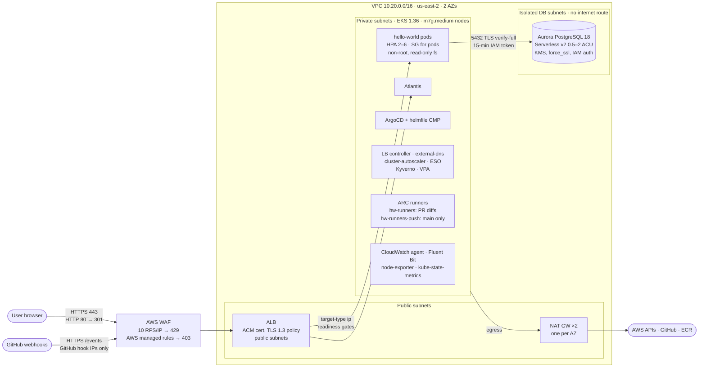
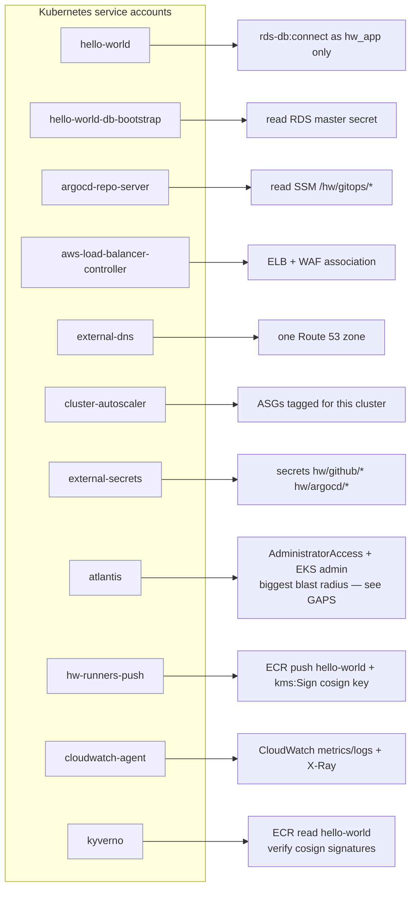
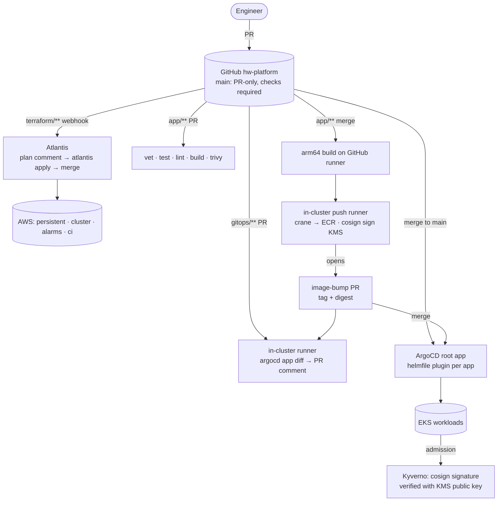
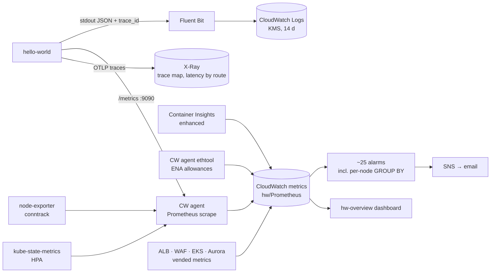

# Architecture

## Runtime: request path, network and data

```mermaid
flowchart LR
  user([User browser]) -->|HTTPS 443<br/>HTTP 80 → 301| waf[AWS WAF<br/>10 RPS/IP → 429<br/>AWS managed rules → 403]
  gh([GitHub webhooks]) -->|HTTPS /events<br/>GitHub hook IPs only| waf
  waf --> alb[ALB<br/>ACM cert, TLS 1.3 policy<br/>public subnets]

  subgraph vpc[VPC 10.20.0.0/16 · us-east-2 · 2 AZs]
    direction LR
    subgraph pub[Public subnets]
      alb
      nat[NAT GW ×2<br/>one per AZ]
    end
    subgraph priv[Private subnets · EKS 1.36 · m7g.medium nodes]
      app[hello-world pods<br/>HPA 2–6 · SG for pods<br/>non-root, read-only fs]
      atl[Atlantis]
      argo[ArgoCD + helmfile CMP]
      ctrl[LB controller · external-dns<br/>cluster-autoscaler · ESO<br/>Kyverno · VPA]
      runners[ARC runners<br/>hw-runners: PR diffs<br/>hw-runners-push: main only]
      obs[CloudWatch agent · Fluent Bit<br/>node-exporter · kube-state-metrics]
    end
    subgraph db[Isolated DB subnets · no internet route]
      aurora[(Aurora PostgreSQL 18<br/>Serverless v2 0.5–2 ACU<br/>KMS, force_ssl, IAM auth)]
    end
  end

  alb -->|target-type ip<br/>readiness gates| app
  alb --> atl
  app -->|5432 TLS verify-full<br/>15-min IAM token| aurora
  priv -->|egress| nat --> internet([AWS APIs · GitHub · ECR])
```

## Identity: who can do what (EKS Pod Identity, no static keys)

```mermaid
flowchart LR
  subgraph k8s[Kubernetes service accounts]
    a1[hello-world]:::sa
    a2[hello-world-db-bootstrap]:::sa
    a3[argocd-repo-server]:::sa
    a4[aws-load-balancer-controller]:::sa
    a5[external-dns]:::sa
    a6[cluster-autoscaler]:::sa
    a7[external-secrets]:::sa
    a8[atlantis]:::sa
    a9[hw-runners-push]:::sa
    a10[cloudwatch-agent]:::sa
    a11[kyverno]:::sa
  end
  a1 --> p1[rds-db:connect as hw_app only]
  a2 --> p2[read RDS master secret]
  a3 --> p3[read SSM /hw/gitops/*]
  a4 --> p4[ELB + WAF association]
  a5 --> p5[one Route 53 zone]
  a6 --> p6[ASGs tagged for this cluster]
  a7 --> p7[secrets hw/github/* hw/argocd/*]
  a8 --> p8[AdministratorAccess + EKS admin<br/>biggest blast radius — see GAPS]
  a9 --> p9[ECR push hello-world + kms:Sign cosign key]
  a10 --> p10[CloudWatch metrics/logs + X-Ray]
  a11 --> p11[ECR read hello-world<br/>verify cosign signatures]
  classDef sa fill:#eef,stroke:#88a
```

## Delivery: GitOps and CI/CD

```mermaid
flowchart TB
  dev([Engineer]) -->|PR| repo[(GitHub hw-platform<br/>main: PR-only, checks required)]

  repo -->|terraform/** webhook| atlantis[Atlantis<br/>plan comment → atlantis apply → merge]
  atlantis --> aws[(AWS: persistent · cluster · alarms · ci)]

  repo -->|gitops/** PR| diff[in-cluster runner<br/>argocd app diff → PR comment]
  repo -->|merge to main| argocd[ArgoCD root app<br/>helmfile plugin per app]
  argocd --> cluster[(EKS workloads)]

  repo -->|app/** PR| ci[vet · test · lint · build · trivy]
  repo -->|app/** merge| build[arm64 build on GitHub runner]
  build --> push[in-cluster push runner<br/>crane → ECR · cosign sign KMS]
  push -->|opens| bump[image-bump PR<br/>tag + digest]
  bump --> diff
  bump -->|merge| argocd
  cluster -->|admission| verify[Kyverno: cosign signature<br/>verified with KMS public key]
```

## Observability

```mermaid
flowchart LR
  app[hello-world] -->|stdout JSON + trace_id| fb[Fluent Bit] --> cwl[(CloudWatch Logs<br/>KMS, 14 d)]
  app -->|/metrics :9090| prom[CW agent<br/>Prometheus scrape]
  ne[node-exporter<br/>conntrack] --> prom
  ksm[kube-state-metrics<br/>HPA] --> prom
  prom --> cwm[(CloudWatch metrics<br/>hw/Prometheus)]
  ci[Container Insights<br/>enhanced] --> cwm
  ena[CW agent ethtool<br/>ENA allowances] --> cwm
  app -->|OTLP traces| xray[(X-Ray<br/>trace map, latency by route)]
  alb[ALB · WAF · EKS · Aurora<br/>vended metrics] --> cwm
  cwm --> alarms[~25 alarms<br/>incl. per-node GROUP BY] --> sns[SNS → email]
  cwm --> dash[hw-overview dashboard]
```
